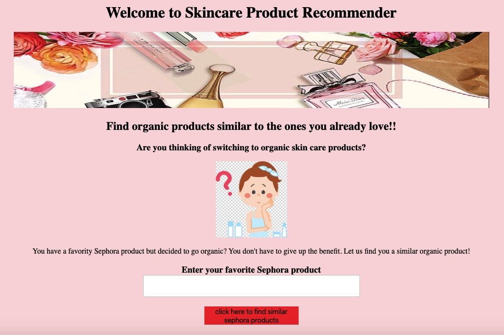
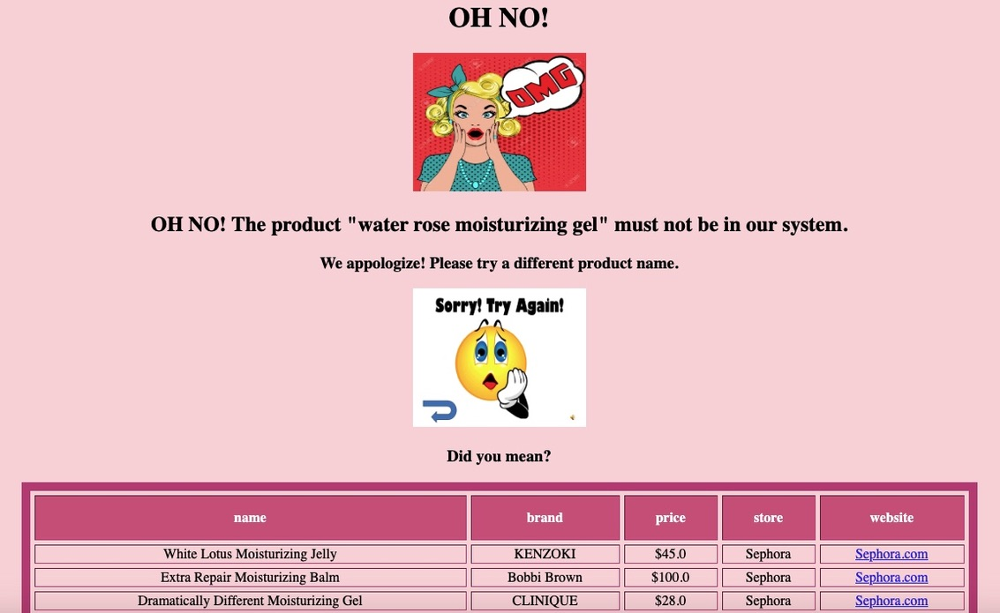
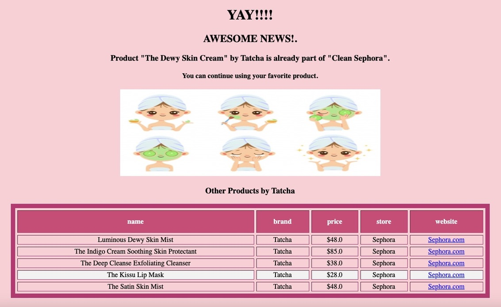
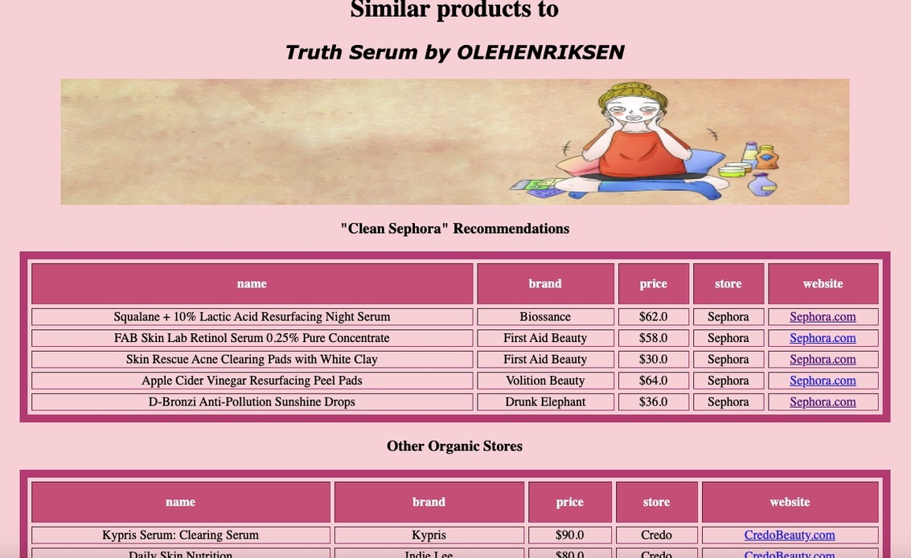

# Skincare Product Recommender

## Table of Contents

[Directory Structure](#Directory-Structure)<br>
[Project Outline / Problem Statement](#Project-Outline-/-Problem-Statement)<br>
[Description of Data](#Description-of-Data)<br>
-[Size](#Size)<br>
-[Source](#Source)<br>
[Data Visualization](#Data-Visualization)<br>
[Next Steps](#Next-Steps)<br>


## Directory Structure

```
.
├── recommender
    ├── gathering_data
        ├── clean_sephora_items.ipynb
        ├── credo_product_data_scrape.ipynb
        ├── follain_product_info_scrape.ipynb
        ├── soups
    ├── cleaning_data
        ├── initial_sephora_clean.ipynb
        ├── initial_follain_clean.ipynb
        ├── initial_credo_clean.ipynb
        ├── icombining_stores.ipynb
    ├── product_recommender.py
    ├── skincare_product_recommender.ipynb
    ├── templates
        ├── page1.html
        ├── page2.html
        ├── page3.html
        ├── page4.html
    ├── static
    ├── images
    ├── data
    ├── README.md
```

## Project Outline / Problem Statement

In recent years we have become more and more concerned with what is in the products we use. It is true for our food, our skincare, and how our clothes are made. 
What happens though if you have a favorite skincare product from [Sephora](https://www.sephora.com/)? It is already really hard to find products that you like initially, and now you are going clean and organic and have to start the process all over again. This is where this project comes in. I wanted to create an organic product alternative to your favorite Sephora skincare products. 

First, Selenium, requests, and BeautifulSoup were used to scrape Sephora, Credo and Follain to gather the data for this project. The data was cleaned and combined together. Credo and Follain are advertised as clean and organic stores that sell makeup and skincare. Sephora also carries traditional products plus they have their "Clean Sephora" section. 

After gathering, cleaning and combining the data pairwise distance was used to calculate the similarity between the products based on what's in them. A Flask App was built to provide the recommendations. 


---
## Description of Data
name of the column|description|break down|
|---|---|---|
|name|the name of the product as listed||
|brand|the brand that makes the product||
|category|category the product falls under|cleanser,moisturizer, mask, eye, treatment, sun, lip|
|price|the price listed in dollars||
|ingredients|list of ingredients in the product as listed||
|store|The store it came from.|Sephora, Credo or Follain|
|url|the original URL gathered with selenium||
|type|what type of product it is|clean of NaN|
|website|this format of url is used in Flask to redirect to product description page||

---
### Size

Initially 2768 Sephora, 613 Credo and 189 Follain product page URLs were gathered respectively.

After removing duplicates, 2457 sephora, 517 credo and 164 follain products were left.

---

### Source

The data was gathered from:

- [Sephore](https://www.sephora.com/)
  
- [Credo](https://credobeauty.com/)

- [Follain](https://follain.com/)


---
## Data Visualization








-------------------------------------

## Next Steps

I would like to further add to the database. Especially the "clean" alternatives. 
I also have two ideas to further improve the recommender app. One is to include being able to enter ingredients and it recommends products with similar ingredients. This way the product you are trying to find an alternative to does not only have to be from Sephora or in the database. 
The second idea is to also extend this to "budget friendly" alternatives. Recommend products that are less expensive but similar. This would include scrapping CVS, Walgreens, Walmart and the like for budget friendly alternatives. 

---

